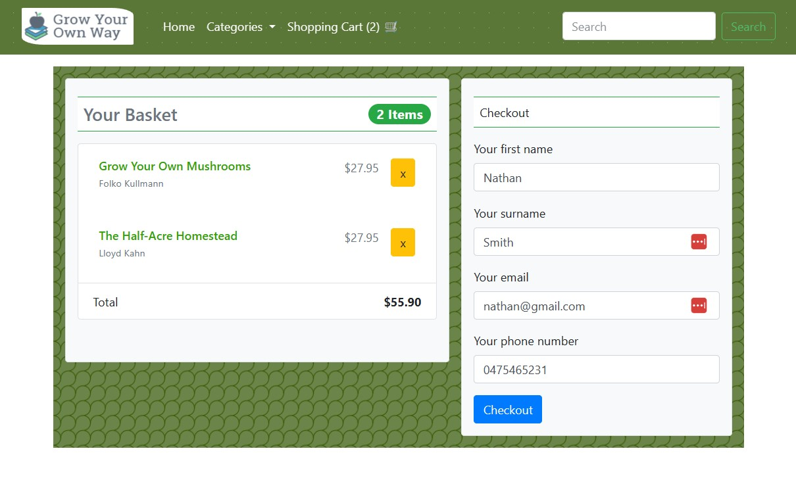
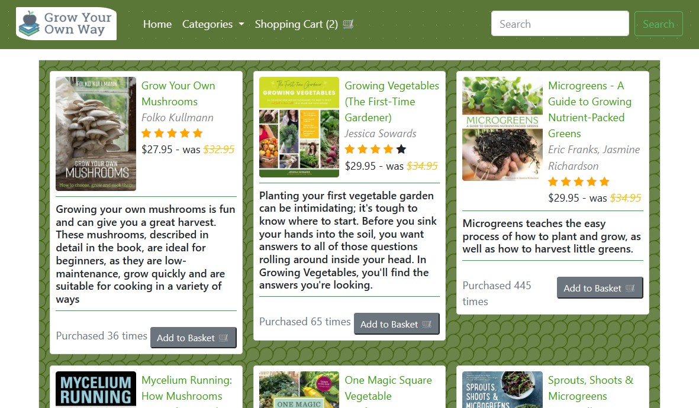

# Flask webstore MVP
A responsive mvp webstore app using Flask, Bootstrap, SQLite to create a simple website. This included product categories, shopping cart and validated contact form.

To demo the application, install the `requirements.txt` in a new environment and execute `run.py`.

### Screenshots:

